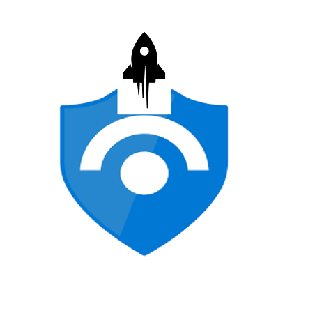

# Azure Sentinel All In One

Azure Sentinel All in One is a project that seeks to speed up deployment and initial configuration tasks of an Azure Sentinel environment. This is ideal for Proof of Concept scenarios and connector onboarding when highly privileged users are needed.

The main script in this repository takes care of the following steps:

- Creates resource group (if given resource group doesn't exist yet)
- Creates Log Analytics workspace (if given workspace doesn't exist yet)
- Installs Azure Sentinel on top of the workspace (if not installed yet)
- Enables the following Data Connectors: 
    + Azure Activity
    + Azure Security Center
    + Azure Active Directory
    + Azure Active Directory Identity Protection
    + Office 365 (Sharepoint, Exchange and Teams)
    + Microsoft Cloud App Security
    + Azure Advanced Threat Protection
    + Microsoft Defender Advanced Threat Protection
    + Threat Intelligence Platforms
- Enables Analytics Rules for enabled Microsoft 1st party products 

## Getting started
These instructions will show you what you need to now to use Sentinel All in One.

### Prerequisites

- [PowerShell Core](https://github.com/PowerShell/PowerShell)
- Azure user account with enough permissions to enable the required connectors. See table below.
- Some data connectors also require a license to be present in order to be enabled. See table below.
- Threat Intelligence Platforms connector requires additional setup documented [here](https://docs.microsoft.com/en-us/azure/sentinel/connect-threat-intelligence#connect-azure-sentinel-to-your-threat-intelligence-platform)

The following table summarizes permissions, licenses needed and cost to enable each Data Connector:

| Data Connector                                 | License         |  Permissions                   | Cost      |
| ---------------------------------------------- | --------------- |--------------------------------|-----------|
| Azure Activity                                 | None            |Reader                          | Free      |
| Azure Security Center                          | ASC Standard    |Security Reader                 | Free      |
| Azure Active Directory                         | Any AAD license |Global Admin or Security Admin  | Billed    |
| Azure Active Directory Identity Protection     | AAD Premium 2   |Global Admin or Security Admin  | Free      |
| Office 365                                     | None            |Global Admin or Security Admin  | Free      |
| Microsoft Cloud App Security                   | MCAS            |Global Admin or Security Admin  | Free      |
| Azure Advanced Threat Protection               | AATP            |Global Admin or Security Admin  | Free      |
| Microsoft Defender Advanced Threat Protection  | MDATP           |Global Admin or Security Admin  | Free      |
| Threat Intelligence Platforms                  | None            |Global Admin or Security Admin  | Billed    |

### Usage

Once you have PowerShell Core installed on your machine, you just need two files from this repo: 

* *connectors.json* - contains all the connectors that will be enabled. If you don't want some of the connectors to be enabled, just remove them from the your copy of the file.

* *SentinelAllInOne.ps1* - script that automates all the steps outlined above.

The script uses your current Azure context, if you want to change the subscription you want to use, make sure you do that before executing the script. You can use `Connect-AzAccount -SubscriptionId <subscription_id>`  to do that

Open a PowerShell core terminal, navigate to the folder where these two files are located and execute *SentinelAllInOne.ps1*. You will be asked to enter the following parameters:

 - **Resource Group** - Resource Group that will contain the Azure Sentinel environment. If the provided resource group already exists, the script will skip its creation.
 - **Workspace** - Name of the Azure Sentinel workspace. If it already exists, the script will skip its creation.
 - **Location** - Location for the resource group and Azure Sentinel workspace.

If not logged in already, the script will ask you to log in to your Azure account. Make sure you have the right permissions to enable the connectors specified in *connectors.json* file.

The script will then iterate through the connectors specified in the *connectors.json* file and enable them. It will also enable the corresponding Microsoft analytics rules.

Here you have a GIF that shows the execution process:

